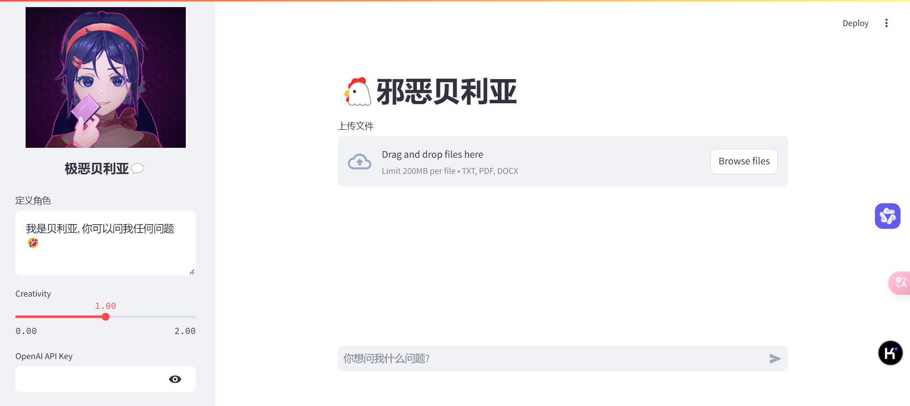

# 简易LLM助手项目

这是一个用于聊天应用和文件处理的LLM简易项目。首次使用前务必填好config.ini文件。

**项目文件详细描述:**

- `DeepSeek/file_processor.py`: **文件处理模块**，负责处理上传的 txt, pdf, docx 文件，提取文件内容。
- `DeepSeek/app.py`: **主应用程序文件**，使用 Streamlit 框架构建用户界面，处理用户输入和显示聊天记录。
- `DeepSeek/chat_history_manager.py`: **聊天历史管理模块**，负责管理聊天历史记录，添加新的消息到历史记录中。
- `DeepSeek/chat_stream.py`: **聊天流处理模块**，负责处理与 OpenAI API 的交互，获取聊天机器人的流式响应。
- `DeepSeek/config_reader.py`: **配置文件读取模块**，负责读取 `config.ini` 配置文件中的 API 密钥和基础 URL 等配置信息。
- `DeepSeek/config.ini`: **配置文件**，用于配置 OpenAI格式 API 的密钥 (`api_key`) 和基础 URL (`base_url`)。
- `DeepSeek/test.ipynb`: **测试用的 Jupyter Notebook**，包含用于测试和实验的代码。
- `DeepSeek/token_counter.py`: **Token 计数模块**，可能用于计算文本中的 token 数量，但代码中没有直接使用，可能是预留模块。
- `DeepSeek/imgs/`: **图片资源目录**，包含应用界面中使用的图片资源，例如 `1.webp` 和 `2.jpg`。

**描述:**

该项目旨在构建一个能够处理文件并提供聊天功能的应用程序。它包含了文件处理、聊天历史管理、配置读取等模块，并提供了一个测试用的 Jupyter Notebook。

**如何运行:**

1. **安装依赖:**
   在项目根目录下运行以下命令安装所需的 Python 库：
   ```bash
   pip install -r requirements.txt 
   ```

2. **配置 API 密钥:**
   - 复制 `config.ini` 文件，并根据你的 OpenAI API 密钥和基础 URL 修改 `config.ini` 文件。
   - 确保在 `config.ini` 文件中配置正确的 `api_key` 和 `base_url`。

3. **运行应用:**
   在项目根目录下运行以下命令启动 Streamlit 应用：
   ```bash
   streamlit run DeepSeek/app.py
   ```

4. **在浏览器中访问:**
   应用启动后，Streamlit 会在终端中显示一个 URL，通常是 `http://localhost:8501`。在浏览器中打开这个 URL 即可访问 DeepSeek 应用。

**requirements.txt**

项目依赖库已在 `requirements.txt` 文件中列出，内容如下：

```
streamlit
openai
python-docx
PyPDF2
```

**config.ini 示例**

```ini
[openai]
api_key=YOUR_API_KEY
base_url=YOUR_BASE_URL
```

请将 `YOUR_API_KEY` 替换为你的 OpenAI API 密钥，`YOUR_BASE_URL` 替换为你的 API 基础 URL。

**项目功能**

- **文件上传和处理:** 用户可以上传 txt, pdf, docx 格式的文件，应用会自动处理并提取文本内容。
- **自定义角色设定:** 用户可以在侧边栏的 "定义角色" 文本框中自定义聊天机器人的角色设定，例如 "我是米塔, 你可以问我任何问题🤣"。
- **创造力 (Temperature) 调整:** 用户可以通过侧边栏的 "Creativity" 滑块调整聊天机器人的创造力参数，值越高，文本越有创造性。
- **聊天互动:** 用户可以在聊天输入框中输入问题，与聊天机器人进行互动。
- **聊天记录显示:** 应用会显示完整的聊天记录，包括用户输入和机器人的回复。

**使用方法**

1. **启动应用后，在侧边栏进行设置:**
   - 在 "定义角色" 文本框中输入你希望聊天机器人扮演的角色。
   - 使用 "Creativity" 滑块调整创造力参数。

2. **上传文件 (可选):**
   - 点击 "上传文件" 按钮，选择 txt, pdf, docx 格式的文件上传。
   - 上传的文件内容将作为聊天机器人的上下文信息。

3. **在聊天输入框中提问:**
   - 在 "你想问我什么问题?" 输入框中输入你的问题。
   - 按下回车键或点击发送按钮发送问题。

4. **查看聊天机器人的回复:**
   - 聊天机器人的回复将以流式方式显示在聊天界面中。
   - 完整的聊天记录将保留在界面上，方便用户回顾。

**注意事项**

- 确保已安装 Python 3.10 或更高版本。
- 首次运行前请安装所有依赖库。
- 配置正确的 OpenAI API 密钥和基础 URL。
- 上传文件支持 txt, pdf, docx 格式。
- 侧边栏可以自定义角色设定和创造力 (Temperature) 参数。
